# 🧾 Innobert Retail

[](https://www.python.org/downloads/)
[](LICENSE)
[]()
[]()

**Sistema de punto de venta profesional para pequeños comercios con control de deudas, inventario, facturación y análisis de ganancias.**

> 💡 *Ideal para tiendas de barrio, minimarkets y emprendedores que quieren dejar el cuaderno y lápiz atrás.*

---

## 🚀 Características principales

| Módulo | Descripción |
|--------|-------------|
| 🛒 **Ventas** | Carrito dinámico, cálculo automático de vuelto, facturación PDF, edición de transacciones |
| 💸 **Deudas** | Créditos con abonos parciales, historial completo, reporte de saldos pendientes |
| 📦 **Inventario** | CRUD completo de productos, soporte de imágenes (PNG, JPG, WEBP, GIF, BMP, TIFF, ICO), control de stock, historial |
| 👥 **Clientes** | Registro rápido, gestión directa en tabla, autocompletado inteligente |
| 📈 **Ganancias** | Reportes diario, semanal, mensual y anual desde la primera transacción |
| 🗑️ **Papelera** | Recuperación de registros eliminados, limpieza automática de datos antiguos (>30 días) |
| 🎨 **Personalización** | Cambio de logo por transacción, múltiples formatos de imagen soportados |

---

## 💡 ¿Por qué Innobert Retail no es un POS común?
- Funciona como un cajero automático integrado: registra ventas rápidas, calcula vuelto y emite facturas sin pasos extra.
- Lleva el control de deudas con pagos parciales, abonos por periodos y resumen de saldos pendientes.
- Registra en tiempo real qué día, fecha, hora y qué producto se entregó en cada operación.
- No es un sistema genérico: está diseñado para negocios locales que necesitan control detallado de facturación, stock y clientes.
- Ofrece seguimiento directo por cliente, deuda y venta, con historial y reportes para cada movimiento.

## 📋 Tabla de contenidos

- [Requisitos previos](#-requisitos-previos)
- [Instalación rápida](#-instalación-rápida)
- [Estructura del proyecto](#-estructura-del-proyecto)
- [Demostraciones interactivas](#-demostraciones-interactivas-por-módulos)
- [Guía rápida](#-guía-rápida-de-uso)
- [Tecnologías](#-tecnologías)
- [Desarrollo](#-desarrollo)
- [Licencia](#-licencia)
- [Contacto](#-contacto)

---

## 📋 Requisitos previos

- **Python 3.11 o superior** (con Tkinter incluido)
- **pip** (gestor de paquetes de Python)
- **Git** (opcional, para clonar el repositorio)
- **Sistemas operativos soportados:**
  - Windows 10/11
  - Linux (Debian, Ubuntu, Fedora)
  - macOS (con soporte experimental)

---

## ⚡ Instalación rápida

### Paso 1: Clonar el repositorio

```bash
git clone https://github.com/innobert/innobert-retail.git
cd innobert-retail
```

### Paso 2: Crear entorno virtual

```bash
python -m venv venv
```

### Paso 3: Activar el entorno virtual

**En Windows (PowerShell):**
```powershell
venv\Scripts\Activate.ps1
```

**En Windows (CMD):**
```batch
venv\Scripts\activate.bat
```

**En Linux/macOS:**
```bash
source venv/bin/activate
```

### Paso 4: Instalar dependencias

```bash
pip install -r requirements.txt
```

### Paso 5: Ejecutar la aplicación

```bash
python inicio.py
```

### Credenciales de prueba
- **Usuario:** `prueba`
- **Contraseña:** `prueba`
---

## 📁 Estructura del proyecto

```
innobert-retail/
├── .git/                     # Repositorio Git
├── .gitignore                # Archivos ignorados
├── inicio.py                 # 🎯 Punto de entrada principal
├── requirements.txt          # Dependencias del proyecto
├── icono.ico                 # Ícono de la aplicación
├── LICENSE                   # Licencia MIT
├── README.md                 # Este archivo
│
├── img/                      # 🖼️ Recursos gráficos (iconos, login, etc.)
│   ├── login.png
│   ├── software.png
│   ├── logo.png
│   └── ... (más iconos)
│
├── fotos/                    # 📸 Imágenes de productos
│   └── default.png           # Imagen por defecto
│
├── docs/                     # 📚 Documentación
│   ├── gifs/                 # GIFs demostrativos
│   └── img/                  # Imágenes de documentación
│
└── retail/                   # 💼 Código fuente principal
    ├── inicio.py
    ├── vistas/               # 🎨 Interfaces gráficas
    │   ├── acceso.py         # Login y registro
    │   ├── contenedor.py     # Ventana principal
    │   ├── inventario.py     # Módulo de inventario
    │   ├── ventas.py         # Módulo de ventas
    │   ├── deudas.py         # Módulo de deudas
    │   └── clientes.py       # Módulo de clientes
    │
    ├── nucleo/               # ⚙️ Lógica de negocio
    │   ├── base_datos.py     # Operaciones SQLite
    │   ├── configuraciones.py# Rutas y configuración
    │   ├── principal.py      # Ventana principal
    │   └── servicios/        # Servicios por módulo
    │       ├── inventario/
    │       ├── ventas/
    │       ├── deudas/
    │       └── clientes/
    │
    ├── utilidades/           # 🔧 Funciones auxiliares
    │   └── logo.py          # Gestor de logo
    │
    ├── sesion/              # 🔐 Autenticación
    │   ├── login.py
    │   └── usuarios.py
    │
    ├── ganancias/           # 📊 Reportes
    │   ├── diario.py
    │   ├── semanal.py
    │   ├── mensual.py
    │   └── anual.py
    │
    └── inventario/          # 📦 Gestión de inventario
        └── historial_inventario.py
```

---

## 🎬 Demostraciones interactivas por módulos

> Todos los módulos ya se encuentran terminados y los GIFs demostrativos están disponibles en `docs/gifs/`.
> Si algún archivo falta, puede consultarse la lista en `docs/GIFS_LIST.md`.

### 📦 Módulo 1: Inventario

#### 1.1 Agregar Producto
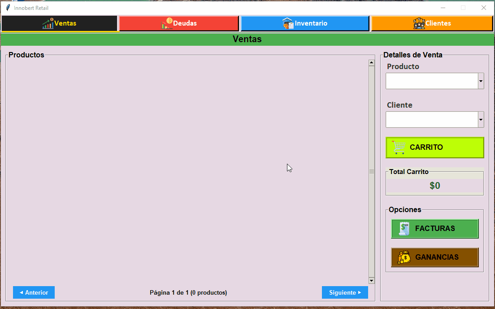

**Pasos:**
1. Haz clic en **Agregar**
2. Completa: Nombre, Precio, Costo, Stock
3. Selecciona imagen (PNG, JPG, WEBP, GIF, etc.)
4. Haz clic en **Guardar**
5. Producto aparece en el canvas

---

#### 1.2 Editar Producto
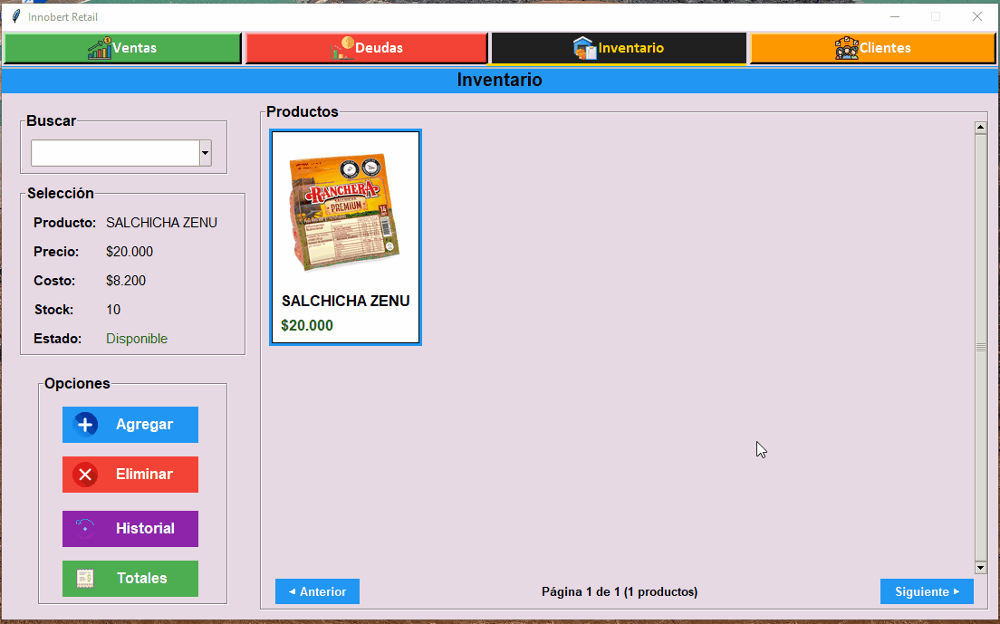

**Pasos:**
1. Haz doble clic en un producto del canvas
2. Modifica precio, costo, stock o stock
3. Haz clic en **Guardar**
4. Cambios se reflejan inmediatamente

---

#### 1.3 Eliminar Producto
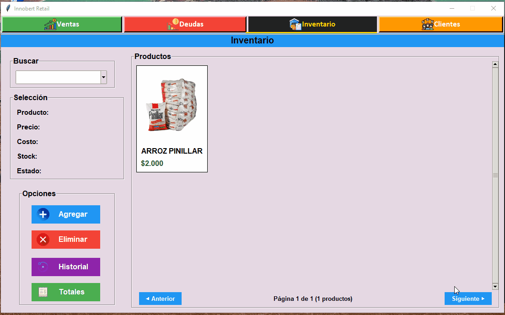

**Pasos:**
1. Selecciona un producto del canvas
2. Haz clic en **Eliminar**
3. Confirma la eliminación
4. Producto desaparece del inventario

---

#### 1.4 Ver Historial de Inventario
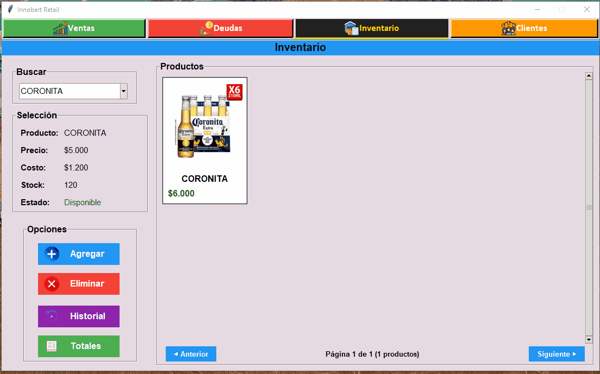

**Pasos:**
1. Selecciona un producto
2. Haz clic en **Historial**
3. Se abre ventana con tabla de movimientos
4. Visualiza: fecha, cantidad, tipo de movimiento

---

#### 1.5 Filtro de Búsqueda
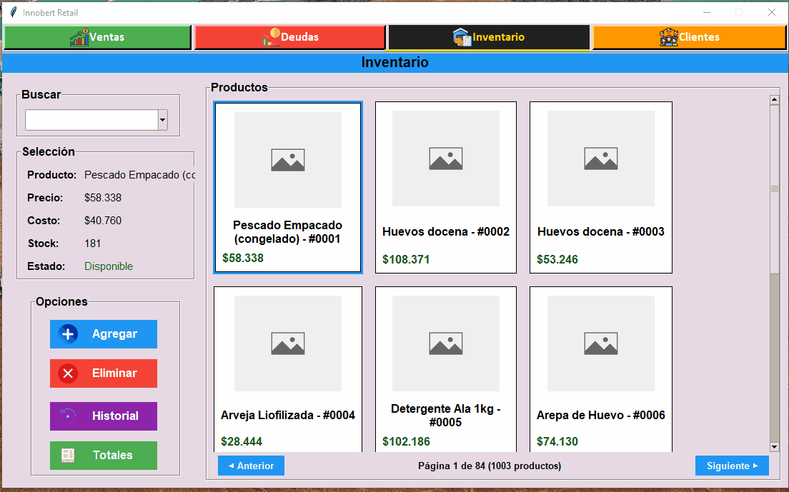

**Pasos:**
1. Escribe el nombre parcial en el campo de búsqueda
2. El canvas se filtra automáticamente
3. Muestra solo productos que coinciden
4. Limpia el campo para ver todos nuevamente

---

### 👥 Módulo 2: Clientes

#### 2.1 Agregar Cliente
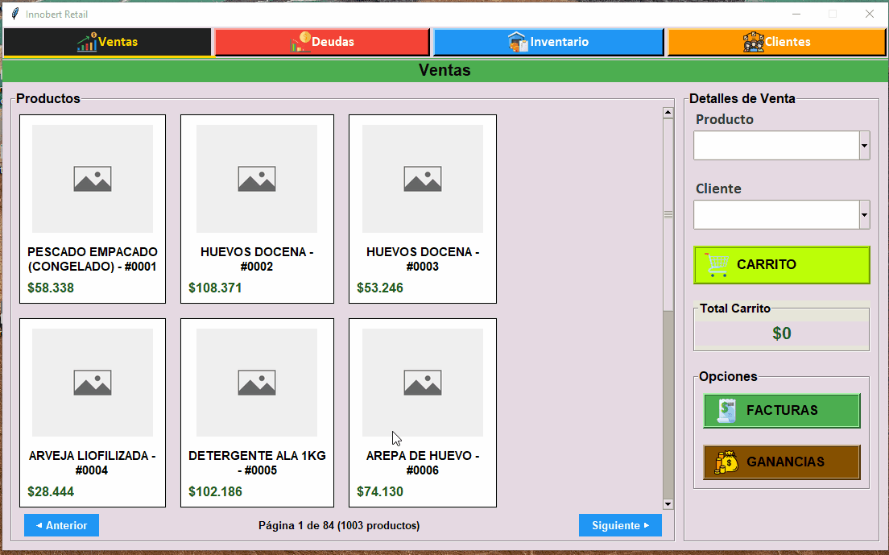

**Pasos:**
1. Haz clic en **Agregar**
2. Completa: Nombre, Teléfono, Email (opcional)
3. Haz clic en **Guardar**
4. Cliente aparece en la tabla

---

#### 2.2 Editar Cliente
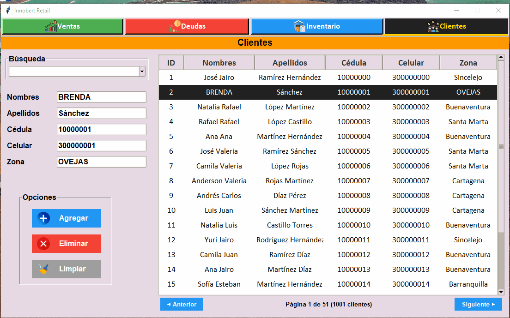

**Pasos:**
1. Haz doble clic en una celda de la tabla
2. Edita los datos directamente
3. Presiona **Enter** o haz clic fuera
4. Los cambios se guardan automáticamente

---

#### 2.3 Eliminar Cliente
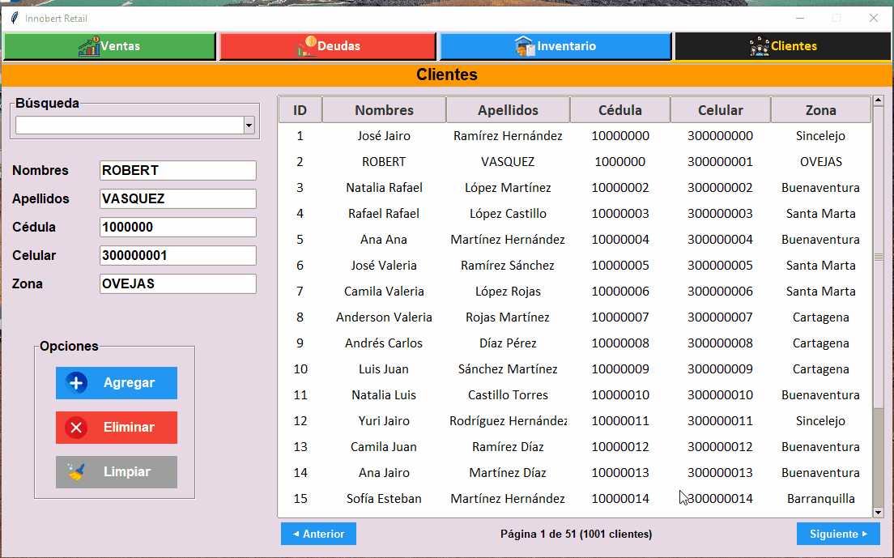

**Pasos:**
1. Selecciona una fila de la tabla
2. Haz clic en **Eliminar**
3. Confirma la eliminación
4. Cliente se mueve a la papelera

---

#### 2.4 Filtrar Clientes
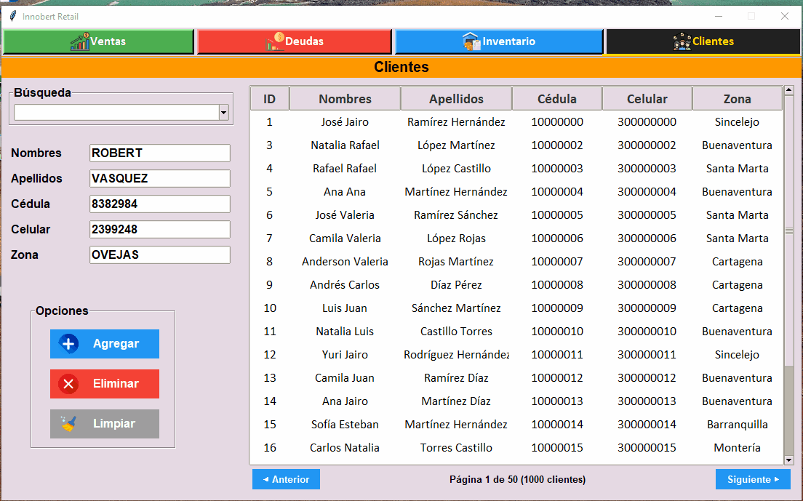

**Pasos:**
1. Escribe en el campo de búsqueda
2. La tabla se filtra automáticamente
3. Muestra solo clientes que coinciden
4. Limpia para ver todos nuevamente

---

### 🛒 Módulo 3: Ventas

#### 3.1 Agregar Producto al Carrito

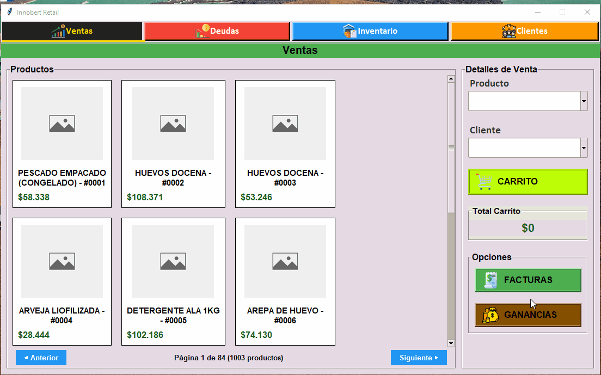

**Pasos:**
1. Selecciona un **Cliente**
2. Haz doble clic en un producto
3. Ingresa la **Cantidad**
4. Producto se agrega al carrito
5. Subtotal se calcula automáticamente

---

#### 3.2 Ver Carrito y Pagar

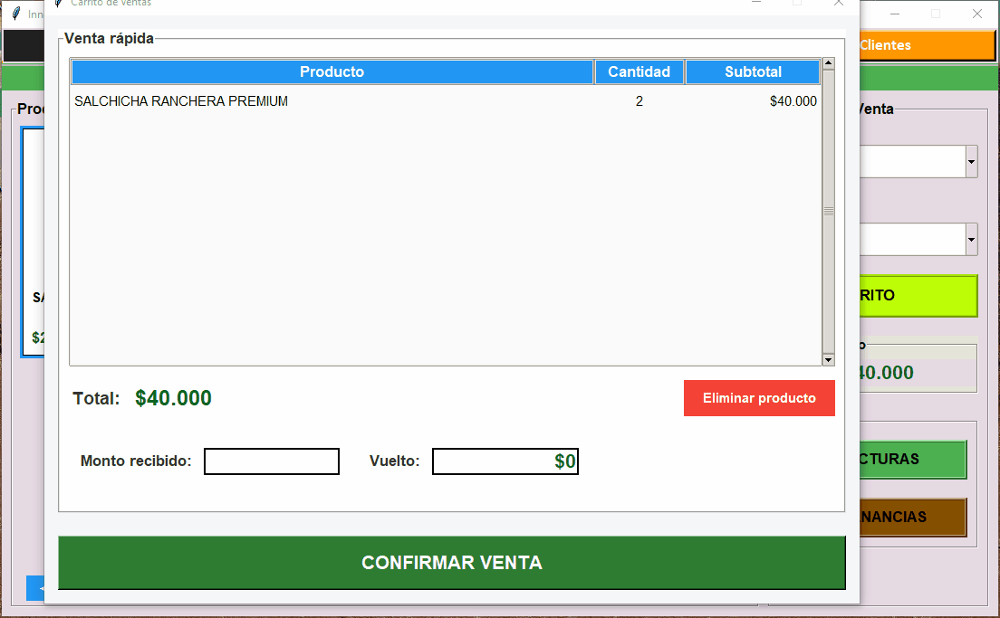

**Pasos:**
1. Abre el **Carrito** de la venta
2. Ingresa el **Monto Recibido**
3. El vuelto se calcula automáticamente
4. Haz clic en **Confirmar Venta**
5. Se genera factura PDF automáticamente

---

#### 3.3 Editar Factura

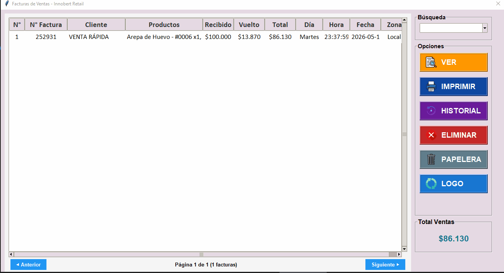

**Pasos:**
1. Ve a **Facturas** (botón verde)
2. Haz doble clic en una factura
3. Edita cantidad de productos o agrega nuevos
4. Haz clic en **Guardar**
5. Cambios se reflejan en la factura

---

#### 3.4 Historial de Ventas

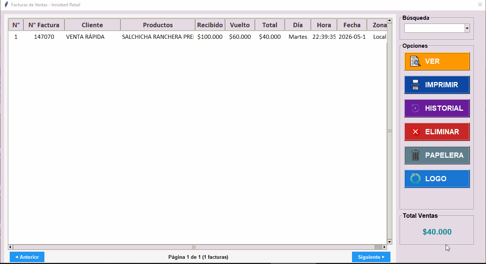

**Pasos:**
1. Selecciona una factura
2. Haz clic en **Historial**
3. Se abre tabla con todas las acciones
4. Visualiza: fecha, acción, usuario, detalles

---

### 💸 Módulo 4: Deudas

#### 4.1 Registrar Deuda
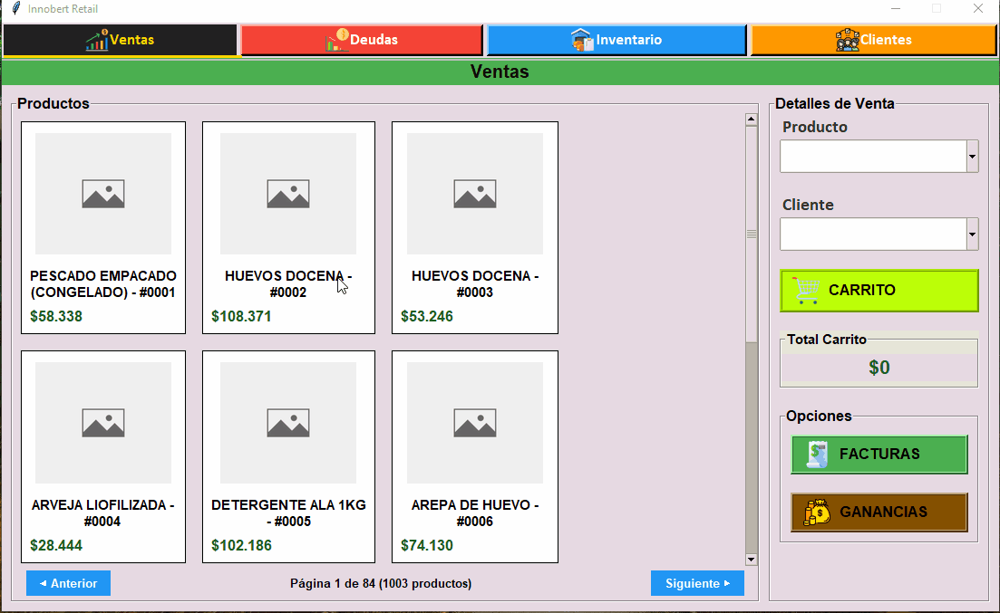

**Pasos:**
1. Selecciona un **Cliente** (obligatorio)
2. Haz doble clic en productos para agregar
3. Ingresa cantidades
4. Abre el **Carrito de Deuda**
5. Haz clic en **Confirmar Deuda**

---

#### 4.2 Ver factura de Deuda
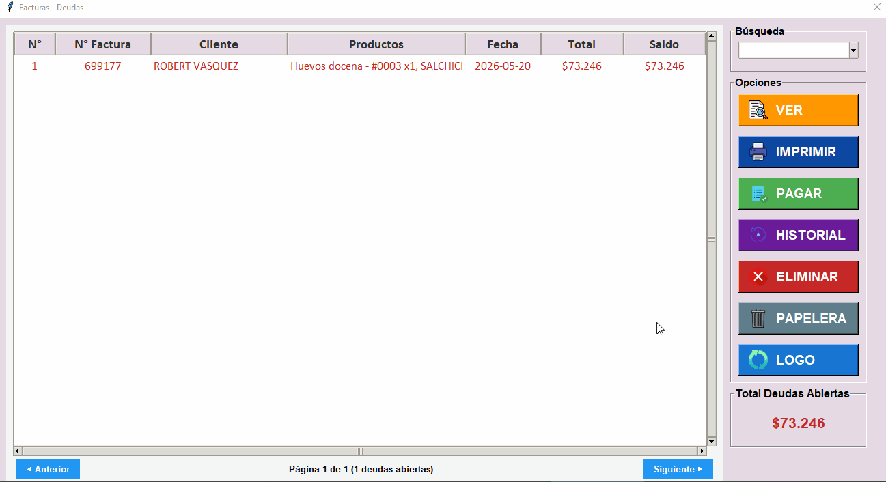

**Pasos:**
1. Ve a **Facturas de Deudas**
2. Selecciona una deuda pendiente
3. Haz clic en **Ver**
4. Revisa el detalle de productos y monto adeudado
5. Cierra para volver a la lista

---

#### 4.3 Imprimir Factura de Deuda
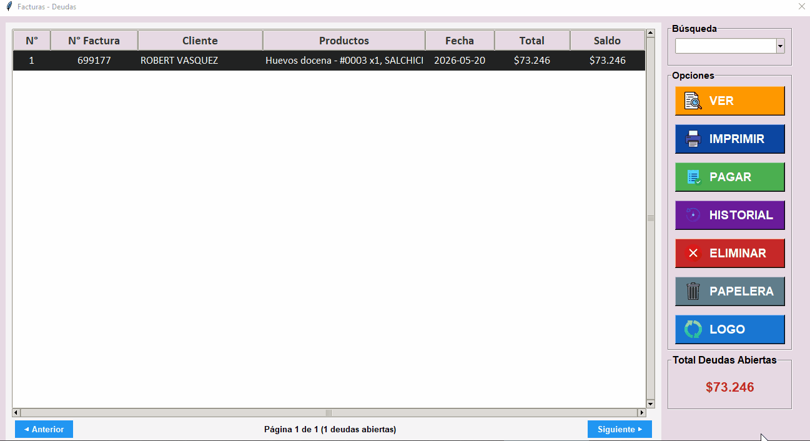

**Pasos:**
1. Selecciona la deuda
2. Haz clic en **Imprimir**
3. Confirma la exportación a PDF
4. Guarda o comparte el documento

---

#### 4.4 Pagar Deuda (Abono)


**Pasos:**
1. Selecciona una deuda pendiente
2. Haz clic en **Pagar**
3. Ingresa monto del abono
4. El sistema actualiza el saldo automáticamente
5. El pago queda registrado en el historial

---

#### 4.5 Historial de Deuda
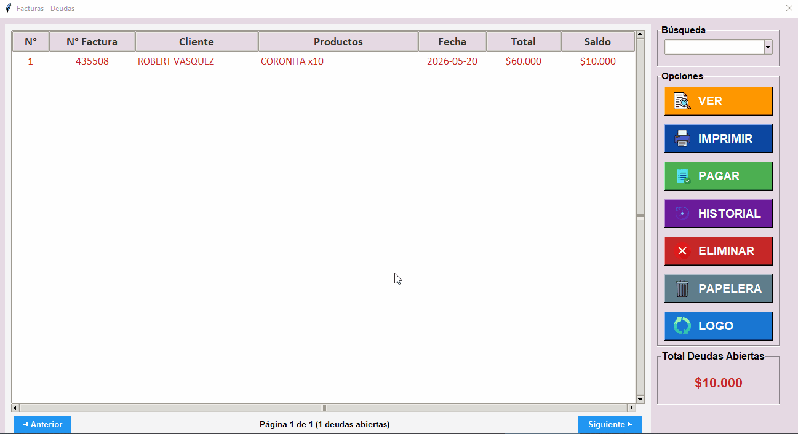

**Pasos:**
1. Selecciona una deuda
2. Haz clic en **Historial**
3. Visualiza:
   - Abonos realizados
   - Productos originales
   - Saldo pendiente
   - Fecha y hora de cada movimiento

---

#### 4.6 Deudas Pagadas
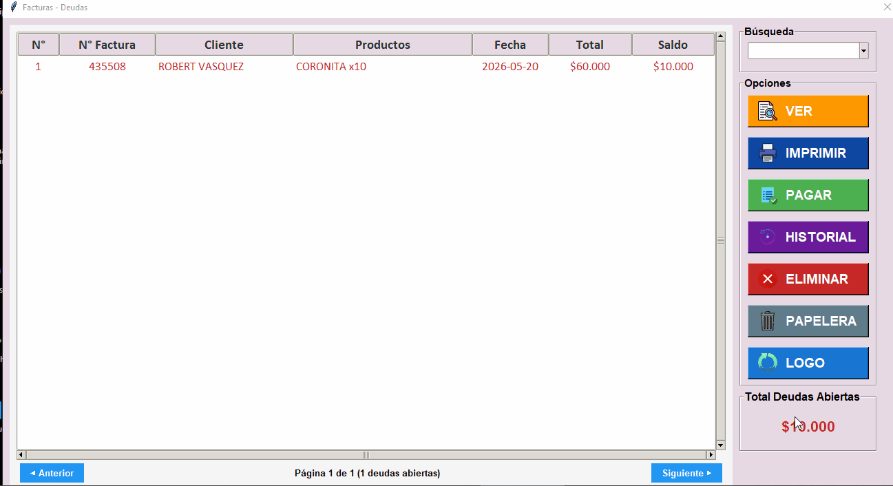

**Pasos:**
1. Ve a pestaña **Pagadas**
2. Visualiza deudas completamente saldadas
3. Filtra por cliente o fecha
4. Genera reportes PDF

---

#### 4.7 Editar Deuda


**Pasos:**
1. Selecciona una deuda existente
2. Haz clic en **Editar**
3. Modifica producto, cantidad o cliente
4. Guarda los cambios
5. El sistema actualiza el registro en tiempo real

---

### 📈 Módulo 5: Ganancias

#### 5.1 Reporte Diario
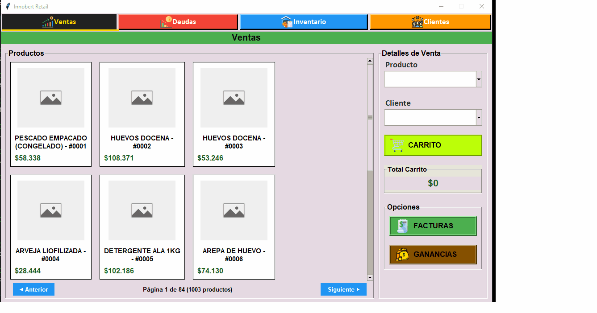

**Pasos:**
1. Abre **Ganancias → Diario**
2. Selecciona la fecha
3. Carga tabla con todas las ventas del día
4. Visualiza: producto, cantidad, ganancia
5. Genera PDF del reporte

---

#### 5.2 Reporte Semanal


**Pasos:**
1. Abre **Ganancias → Semanal**
2. Navega entre semanas
3. Visualiza ganancia total de 7 días
4. Desglose por día de la semana
5. Descarga PDF

---

#### 5.3 Reporte Mensual


**Pasos:**
1. Abre **Ganancias → Mensual**
2. Selecciona el mes y año
3. Muestra ganancia total del mes
4. Tabla con totales diarios
5. Exporta a PDF

---

#### 5.4 Reporte Anual


**Pasos:**
1. Abre **Ganancias → Anual**
2. Selecciona el año
3. Muestra ganancia total anual
4. Desglose por mes
5. Genera reporte PDF completo

---

## 🎯 Guía rápida de uso

### 📦 Módulo Inventario
- Agregar, editar, eliminar productos con imágenes
- Control de stock automático
- Historial de movimientos
- Filtro continuo y consulta rápida por producto

### 👥 Módulo Clientes
- Registro rápido de clientes
- Edición directa en tabla
- Búsqueda por nombre
- Gestión de fichas de clientes para ventas, deudas y facturación

### 🛒 Módulo Ventas
- Carrito dinámico estilo cajero automático
- Cálculo automático de vuelto en tiempo real
- Facturación PDF y guardado inmediato
- Registro de hora y fecha exacta de cada venta

### 💸 Módulo Deudas
- Registro de créditos con selección de cliente obligatoria
- Pagos parciales y abonos en periodos de tiempo
- Historial completo de movimientos y saldo pendiente
- Control en tiempo real de qué producto se entregó y cuándo

### 📈 Módulo Ganancias
- Reportes diario, semanal, mensual y anual
- Exportación a PDF
- Análisis de rentabilidad y totales por periodo
- Comparativa de ventas y ganancias en tiempo real

---

## 🛠️ Tecnologías utilizadas

| Tecnología | Propósito | Versión |
|------------|-----------|---------|
| **Python** | Lenguaje principal | 3.11+ |
| **Tkinter** | Interfaz gráfica nativa | Incluido |
| **SQLite3** | Base de datos embebida | Incluido |
| **Pillow** | Procesamiento de imágenes | 12.2.0 |
| **ReportLab** | Generación de PDFs | Última |
| **PyInstaller** | Empaquetado ejecutable | Última |

---

## 👨‍💻 Desarrollo

### Clonar el repositorio

```bash
git clone https://github.com/innobert/innobert-retail.git
cd innobert-retail
```

### Instalar en modo desarrollo

```bash
python -m venv venv
# Activar venv (como se indicó arriba)
pip install -r requirements.txt
```

### Ejecutar con debugging

```bash
python -m pdb inicio.py
```

### Generar requirements.txt actualizado

```bash
pip freeze > requirements.txt
```

### Crear ejecutable para Windows

```bash
pip install pyinstaller
pyinstaller --onefile --windowed --icon=icono.ico inicio.py
```

El ejecutable estará en `dist/inicio.exe`

---

## 🤝 Contribuciones

¡Las contribuciones son bienvenidas! Sigue estos pasos:

1. **Fork** el proyecto
2. Crea una rama para tu funcionalidad:
   ```bash
   git checkout -b feature/mi-funcionalidad
   ```
3. Realiza tus cambios y commitea:
   ```bash
   git commit -m "Agregar mi funcionalidad"
   ```
4. Sube la rama:
   ```bash
   git push origin feature/mi-funcionalidad
   ```
5. Abre un **Pull Request** describiendo los cambios

### Estándares de código

- Usa **Black** para formatear:
  ```bash
  pip install black
  black .
  ```
- Mantén funciones pequeñas y documentadas
- Comenta lógica compleja

---

## 📝 Licencia

Este proyecto se distribuye bajo la **Licencia MIT**. Consulta el archivo [LICENSE](LICENSE) para más detalles.

---

## 📞 Contacto

**Roberto Vásquez** (InnobertDev)

- 📞 WhatsApp: [+57 304 210 4313](https://wa.me/573042104313)
- 📷 Instagram: [@innobertdev](https://instagram.com/innobertdev)
- 📧 Email: [innobert07@gmail.com](mailto:innobert07@gmail.com)
- 🐙 GitHub: [innobert](https://github.com/innobert)

---

## ⭐ Agradecimiento

Si este software te ha sido útil en tu negocio, ¡no olvides darle una **estrella en GitHub**! ⭐

Tu apoyo es muy importante y nos motiva a seguir mejorando el proyecto.

---

## 🐛 Reportar problemas

Si encuentras un bug o deseas sugerir una mejora, abre un [Issue](https://github.com/innobert/innobert-retail/issues) describiendo:
- El problema o sugerencia
- Pasos para reproducirlo (si aplica)
- Capturas de pantalla si es necesario
- Tu versión de Python y SO

---

## ⚠️ Nota importante sobre ejecución local
Este software está desarrollado para funcionar en un entorno local. Por esa razón, es posible que no se muestre perfectamente en todas las resoluciones de pantalla o configuraciones de monitor.

Además, el módulo de sesión actualmente no se encuentra completamente aislado como un servicio independiente; es un cambio previsto para futuras versiones.

Si deseas adaptar el software a tu entorno de negocio, tienda, licorería o emprendimiento, y necesitas soporte para personalizarlo en tu flujo de trabajo, puedes contactarme para recibir ayuda a medida.

---

**Última actualización:** Mayo 2026 | **Versión:** 1.0.0
